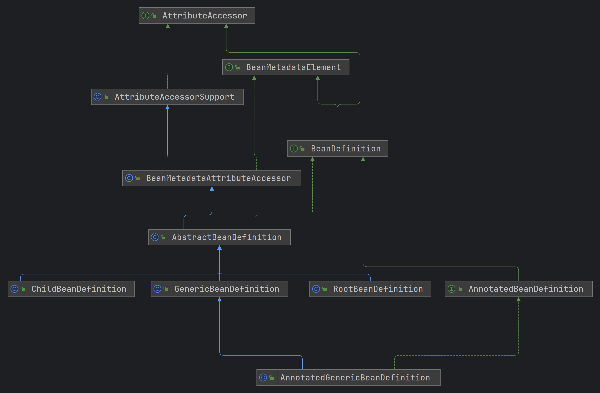

## 1. BeanDefinition

Spring会将所有Bean的配置转化为BeanDefinition。



BeanDefinition有四个具体类，如下：

1. GenericBeanDefinition：既可以表示RootBeanDefinition，也可以表示ChildBeanDefinition
2. RootBeanDefinition： 
3. ChildBeanDefinition：
4. AnnotatedGenericBeanDefinition 注解定义的Bean都会被转化为他

## 2. 测试

```java
public class BeanDefinitionTest {

	@Test
	public void genericBeanDefinition() {
		AbstractBeanDefinition beanDefinition = BeanDefinitionBuilder.genericBeanDefinition(User.class)
				.getBeanDefinition();
		Assertions.assertEquals(GenericBeanDefinition.class, beanDefinition.getClass());
	}

	@Test
	public void rootBeanDefinition() {
		AbstractBeanDefinition beanDefinition = BeanDefinitionBuilder.rootBeanDefinition(User.class)
				.getBeanDefinition();
		Assertions.assertEquals(RootBeanDefinition.class, beanDefinition.getClass());
	}

	@Test
	public void childBeanDefinition() {
		AbstractBeanDefinition beanDefinition = BeanDefinitionBuilder.childBeanDefinition("parent1")
				.getBeanDefinition();
		Assertions.assertEquals(ChildBeanDefinition.class, beanDefinition.getClass());
	}

	@Test
	public void annotationBeanDefinition() {
		DefaultListableBeanFactory beanFactory = new DefaultListableBeanFactory();
		XmlBeanDefinitionReader reader = new XmlBeanDefinitionReader(beanFactory);
		reader.loadBeanDefinitions("classpath:framework/beandefinition/beans.xml");
		for (String beanName : beanFactory.getBeanDefinitionNames()) {
			System.out.printf("beanName:%s，BeanDefinition:%s\n", beanName, beanFactory.getBeanDefinition(beanName));
		}

		System.out.println("============MergedBeanDefinition=============");
		System.out.println(beanFactory.getMergedBeanDefinition("user3"));
		System.out.println(beanFactory.getMergedBeanDefinition("user4"));
		System.out.println(beanFactory.getMergedBeanDefinition("user5"));
	}
}

```

定义beans.xml

```java
<?xml version="1.0" encoding="UTF-8"?>
<beans xmlns="http://www.springframework.org/schema/beans"
	   xmlns:xsi="http://www.w3.org/2001/XMLSchema-instance"
	   xsi:schemaLocation="http://www.springframework.org/schema/beans
    http://www.springframework.org/schema/beans/spring-beans-4.3.xsd">

	<bean id="user1" class="com.wrp.spring.framework.beandefinition.User"/>
	<bean id="user2" abstract="true"/>
	<bean id="user3" class="com.wrp.spring.framework.beandefinition.User" parent="user1"/>
	<bean id="user4" class="com.wrp.spring.framework.beandefinition.User" parent="user2"/>
	<bean id="user5" class="com.wrp.spring.framework.beandefinition.User" parent="user3"/>
</beans>
```

结果：

1. 可以通过BeanDefinitionBuilder工具创建BeanDefinition，使用了[建造者模式]()
2. xml解析后，所有的都是GenericBeanDefinition，合并BeanDefinition后转化为RootBeanDefinition

## 3. Beandefinition源码

```java
public interface BeanDefinition extends AttributeAccessor, BeanMetadataElement {

	String SCOPE_SINGLETON = ConfigurableBeanFactory.SCOPE_SINGLETON;
	String SCOPE_PROTOTYPE = ConfigurableBeanFactory.SCOPE_PROTOTYPE;

	void setParentName( String parentName);
	String getParentName();

	void setBeanClassName( String beanClassName);
	String getBeanClassName();

	void setScope( String scope);
	String getScope();

	void setLazyInit(boolean lazyInit);
	boolean isLazyInit();

	void setDependsOn( String... dependsOn);
	String[] getDependsOn();

	void setAutowireCandidate(boolean autowireCandidate);
	boolean isAutowireCandidate();

	void setPrimary(boolean primary);
	boolean isPrimary();

    // 工厂Bean方式创建BeanDefinition，需要指定工厂，以及工厂的创建方法
	void setFactoryBeanName( String factoryBeanName);
	String getFactoryBeanName();
	void setFactoryMethodName( String factoryMethodName);
	String getFactoryMethodName();

    // 构造器参数
	ConstructorArgumentValues getConstructorArgumentValues();
	default boolean hasConstructorArgumentValues() {
		return !getConstructorArgumentValues().isEmpty();
	}

    // 属性参数
	MutablePropertyValues getPropertyValues();
	default boolean hasPropertyValues() {
		return !getPropertyValues().isEmpty();
	}

	void setInitMethodName( String initMethodName);
	String getInitMethodName();

	void setDestroyMethodName( String destroyMethodName);
	String getDestroyMethodName();

    // bean的描述信息
	void setDescription( String description);
	String getDescription();
	
    // 获取bean的泛型信息
	ResolvableType getResolvableType();
    
	boolean isSingleton();
	boolean isPrototype();

	boolean isAbstract();
	// 返回beanDefinition的配置源描述，便于在异常时排查问题
	String getResourceDescription();

	BeanDefinition getOriginatingBeanDefinition();
}
```

这些信息均在`AbstractBeanDefinition`中定义

```java
public abstract class AbstractBeanDefinition extends BeanMetadataAttributeAccessor
		implements BeanDefinition, Cloneable {
	/**
	 * 两种可能：
	 * 1. Class: 不需要加载
	 * 2. String: 类的全限定类名，需要解析为Class，并存储在beanClass
	 */
	
	private volatile Object beanClass;

	private Boolean lazyInit;
    
	private String[] dependsOn;

	// false 会被注入到spring容器中，但是不会进行DI
	private boolean autowireCandidate = true;

	private boolean defaultCandidate = true;

	// 不管是什么值，都会被注入到容器中,也可以进行DI
	private boolean primary = false;
	
	private String factoryBeanName;

	private String factoryMethodName;
	
	private ConstructorArgumentValues constructorArgumentValues;
	
	private MutablePropertyValues propertyValues;

	private MethodOverrides methodOverrides = new MethodOverrides();
	
	private String[] initMethodNames;
	
	private String[] destroyMethodNames;
	
	private String description;
	
	private Resource resource;
}
```

