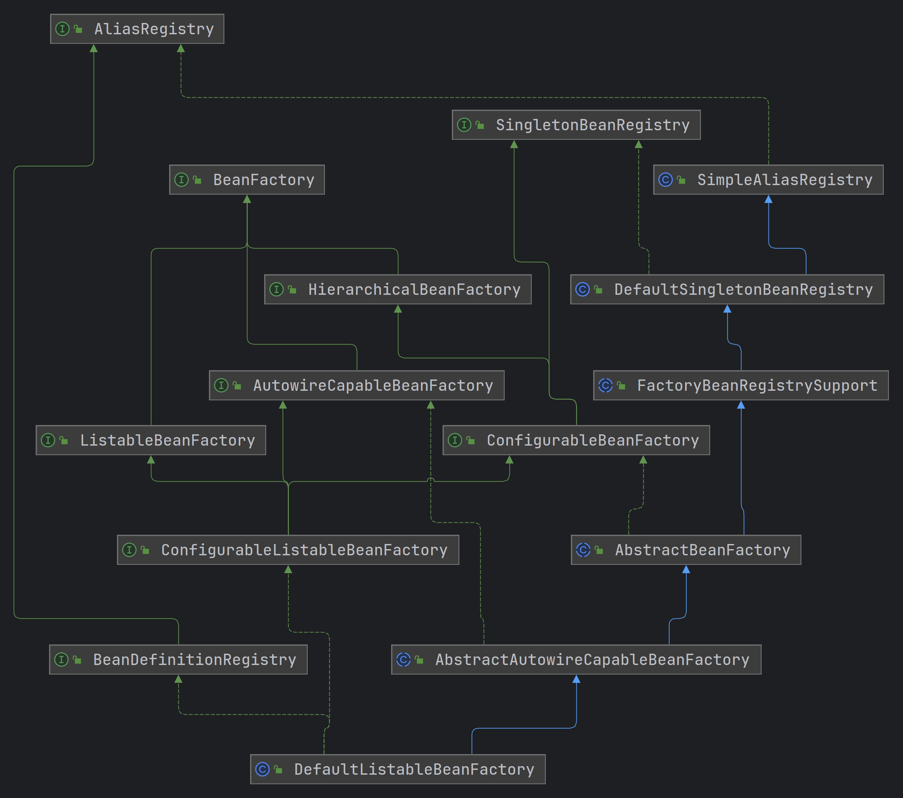

## BeanFactory

> BeanFactory是Spring容器顶层类




1. BeanFactory：获取、判断Bean的一些基础信息，如是否单例、是否多例、是否是指定类型的Bean等等。
2. ListableBeanFactory：获取指定类型的Bean集合
3. HierarchicalBeanFactory：支持多层级的容器
4. AutowireCapableBeanFactory
5. ConfigurableBeanFactory
6. ConfigurableListableBeanFactory
7. DefaultListableBeanFactory：唯一实现，其他的类的功能实现都委托给他
8. AliasRegistry
9. BeanDefinitionRegistry
10. SingletonBeanRegistry

## BeanFactory源码

```java
// 获取Bean
public interface BeanFactory {

    // 根据名称获取Bean
    Object getBean(String name) throws BeansException;
  
    // 根据名称和类型获取Bean
    <T> T getBean(String name, Class<T> requiredType) throws BeansException;

    // 根据名称获取Bean，args在新建Bean时生效
    Object getBean(String name, Object... args) throws BeansException;

    // 根据类型获取Bean
    <T> T getBean(Class<T> requiredType) throws BeansException;

    // 根据类型获取Bean，args在新建Bean时生效
    <T> T getBean(Class<T> requiredType, Object... args) throws BeansException;

    // 根据类型获取ObjectProvider
    <T> ObjectProvider<T> getBeanProvider(Class<T> requiredType);
    <T> ObjectProvider<T> getBeanProvider(ResolvableType requiredType);

    // 是否包含Bean
    boolean containsBean(String name);
    // 是否是单例Bean
    boolean isSingleton(String name) throws NoSuchBeanDefinitionException;
    // 是否是多例Bean
    boolean isPrototype(String name) throws NoSuchBeanDefinitionException;
    // 是否类型匹配
    boolean isTypeMatch(String name, ResolvableType typeToMatch) throws NoSuchBeanDefinitionException;
    // 是否类型匹配
    boolean isTypeMatch(String name, Class<?> typeToMatch) throws NoSuchBeanDefinitionException;

    // 获取Bean的类型
    Class<?> getType(String name) throws NoSuchBeanDefinitionException;
    // 获取Bean的类型
    Class<?> getType(String name, boolean allowFactoryBeanInit) throws NoSuchBeanDefinitionException;
    // 获取Bean的别名
    String[] getAliases(String name);
}
```

```java
// 获取Bean列表
public interface ListableBeanFactory extends BeanFactory {

    // 是否包含指定名称的BeanDefinition
	boolean containsBeanDefinition(String beanName);

    // 获取BeanDefinition的数量
	int getBeanDefinitionCount();

    // 获取所有的BeanDefinition的名称
	String[] getBeanDefinitionNames();

    // 获取ObjectProvider
	<T> ObjectProvider<T> getBeanProvider(Class<T> requiredType, boolean allowEagerInit);
	<T> ObjectProvider<T> getBeanProvider(ResolvableType requiredType, boolean allowEagerInit);

    // 获取指定类型的Bean名称数组
	String[] getBeanNamesForType(ResolvableType type);
	String[] getBeanNamesForType(ResolvableType type, boolean includeNonSingletons, boolean allowEagerInit);
	String[] getBeanNamesForType(@Nullable Class<?> type);
	String[] getBeanNamesForType(@Nullable Class<?> type, boolean includeNonSingletons, boolean allowEagerInit);

    // 获取指定类型的Map
	<T> Map<String, T> getBeansOfType(@Nullable Class<T> type) throws BeansException;
	<T> Map<String, T> getBeansOfType(@Nullable Class<T> type, boolean includeNonSingletons, boolean allowEagerInit)
			throws BeansException;

    // 获取有指定注解的Bean
	String[] getBeanNamesForAnnotation(Class<? extends Annotation> annotationType);
	Map<String, Object> getBeansWithAnnotation(Class<? extends Annotation> annotationType) throws BeansException;
	<A extends Annotation> A findAnnotationOnBean(String beanName, Class<A> annotationType)
			throws NoSuchBeanDefinitionException;
	<A extends Annotation> A findAnnotationOnBean(
			String beanName, Class<A> annotationType, boolean allowFactoryBeanInit)
			throws NoSuchBeanDefinitionException;
	<A extends Annotation> Set<A> findAllAnnotationsOnBean(
			String beanName, Class<A> annotationType, boolean allowFactoryBeanInit)
			throws NoSuchBeanDefinitionException;
}
```

```java
// 支持多层级的spring容器
public interface HierarchicalBeanFactory extends BeanFactory {

	@Nullable
	BeanFactory getParentBeanFactory();

    // 判断当前spring容器中是否包含bean
	boolean containsLocalBean(String name);
}
```

```java
// 支持自动能力的spring容器, 创建、初始化和销毁Bean
public interface AutowireCapableBeanFactory extends BeanFactory {

	// 创建Bean
	<T> T createBean(Class<T> beanClass) throws BeansException;

	// 初始化Bean
	void autowireBean(Object existingBean) throws BeansException;

    // 初始化Bean
	Object configureBean(Object existingBean, String beanName) throws BeansException;

    // 创建Bean
	@Deprecated(since = "6.1")
	Object createBean(Class<?> beanClass, int autowireMode, boolean dependencyCheck) throws BeansException;

    // 创建并初始化Bean
	Object autowire(Class<?> beanClass, int autowireMode, boolean dependencyCheck) throws BeansException;

    // 初始化Bean
	void autowireBeanProperties(Object existingBean, int autowireMode, boolean dependencyCheck)
			throws BeansException;

    // 属性赋值
	void applyBeanPropertyValues(Object existingBean, String beanName) throws BeansException;

    // 初始化阶段，初始化前、初始化方法、初始化后
	Object initializeBean(Object existingBean, String beanName) throws BeansException;

    // 初始化前钩子
	@Deprecated(since = "6.1")
	Object applyBeanPostProcessorsBeforeInitialization(Object existingBean, String beanName)
			throws BeansException;

    // 初始化后钩子
	@Deprecated(since = "6.1")
	Object applyBeanPostProcessorsAfterInitialization(Object existingBean, String beanName)
			throws BeansException;

    // 销毁阶段，销毁前钩子，销毁方法
	void destroyBean(Object existingBean);

    // 获取Bean
	<T> NamedBeanHolder<T> resolveNamedBean(Class<T> requiredType) throws BeansException;

    // 获取Bean
	Object resolveBeanByName(String name, DependencyDescriptor descriptor) throws BeansException;

    // 获取Bean
	@Nullable
	Object resolveDependency(DependencyDescriptor descriptor, @Nullable String requestingBeanName) throws BeansException;

    // 获取Bean
	@Nullable
	Object resolveDependency(DependencyDescriptor descriptor, @Nullable String requestingBeanName,
			@Nullable Set<String> autowiredBeanNames, @Nullable TypeConverter typeConverter) throws BeansException;
}
```

```java
// 支持丰富的配置信息的BeanFactory
public interface ConfigurableBeanFactory extends HierarchicalBeanFactory, SingletonBeanRegistry {

	String SCOPE_SINGLETON = "singleton";

	String SCOPE_PROTOTYPE = "prototype";

	// 设置上级容器
	void setParentBeanFactory(BeanFactory parentBeanFactory) throws IllegalStateException;
    
    // 设置类加载器
	void setBeanClassLoader(@Nullable ClassLoader beanClassLoader);
	@Nullable
	ClassLoader getBeanClassLoader();
	void setTempClassLoader(@Nullable ClassLoader tempClassLoader);
	@Nullable
	ClassLoader getTempClassLoader();

    // 是否缓存Bean元信息
	void setCacheBeanMetadata(boolean cacheBeanMetadata);
	boolean isCacheBeanMetadata();

    // 设置Bean表达式解析器，有一个默认实现StandardBeanExpressionResolver
	void setBeanExpressionResolver(@Nullable BeanExpressionResolver resolver);
	@Nullable
	BeanExpressionResolver getBeanExpressionResolver();

    // 设置使用多线程预生成Bean时的线程池
	void setBootstrapExecutor(@Nullable Executor executor);
	@Nullable
	Executor getBootstrapExecutor();

    //设置转换服务 
	void setConversionService(@Nullable ConversionService conversionService);
	@Nullable
	ConversionService getConversionService();

    // 设置属性编辑器
	void addPropertyEditorRegistrar(PropertyEditorRegistrar registrar);
	void registerCustomEditor(Class<?> requiredType, Class<? extends PropertyEditor> propertyEditorClass);
	void copyRegisteredEditorsTo(PropertyEditorRegistry registry);

    // 设置类型转换器
	void setTypeConverter(TypeConverter typeConverter);
	TypeConverter getTypeConverter();

    // 解析内嵌值
	void addEmbeddedValueResolver(StringValueResolver valueResolver);
	boolean hasEmbeddedValueResolver();
	String resolveEmbeddedValue(String value);

    // 添加BeanPostProcessor
	void addBeanPostProcessor(BeanPostProcessor beanPostProcessor);
	int getBeanPostProcessorCount();

    // 注册Scope
	void registerScope(String scopeName, Scope scope);
	String[] getRegisteredScopeNames();
	@Nullable
	Scope getRegisteredScope(String scopeName);

    // 设置启动时的记录
	void setApplicationStartup(ApplicationStartup applicationStartup);
	ApplicationStartup getApplicationStartup();

    // 批量赋值
	void copyConfigurationFrom(ConfigurableBeanFactory otherFactory);

    // 注册、解析别名
	void registerAlias(String beanName, String alias) throws BeanDefinitionStoreException;
	void resolveAliases(StringValueResolver valueResolver);

    // 合并BeanDefinition
	BeanDefinition getMergedBeanDefinition(String beanName) throws NoSuchBeanDefinitionException;

    // 是否是FactoryBean
	boolean isFactoryBean(String name) throws NoSuchBeanDefinitionException;

    // 当前Bean是否正在创建
	void setCurrentlyInCreation(String beanName, boolean inCreation);
	boolean isCurrentlyInCreation(String beanName);

    // 注册依赖关系。key被依赖者，value是依赖者
	void registerDependentBean(String beanName, String dependentBeanName);
	String[] getDependentBeans(String beanName);
    
	String[] getDependenciesForBean(String beanName);

    // 销毁单例
	void destroyBean(String beanName, Object beanInstance);

    // 移除Scope
	void destroyScopedBean(String beanName);

    // 销毁所有的单例
	void destroySingletons();

}
```

```java
// 组合了三大接口
public interface ConfigurableListableBeanFactory
		extends ListableBeanFactory, AutowireCapableBeanFactory, ConfigurableBeanFactory {

    // 忽略指定类型的依赖
	void ignoreDependencyType(Class<?> type);
    // 忽略指定接口类型的依赖
	void ignoreDependencyInterface(Class<?> ifc);
    // 注册指定类型的依赖
	void registerResolvableDependency(Class<?> dependencyType, @Nullable Object autowiredValue);

    // Bean是否是自动注入候选
	boolean isAutowireCandidate(String beanName, DependencyDescriptor descriptor)
			throws NoSuchBeanDefinitionException;

    // 获取BeanDefinition
	BeanDefinition getBeanDefinition(String beanName) throws NoSuchBeanDefinitionException;

    // 获取BeanName遍历器
	Iterator<String> getBeanNamesIterator();

    // 清除缓存
	void clearMetadataCache();

    // 固定配置
	void freezeConfiguration();
	boolean isConfigurationFrozen();

    // 提前实例化非延迟单例Bean
	void preInstantiateSingletons() throws BeansException;

}
```

