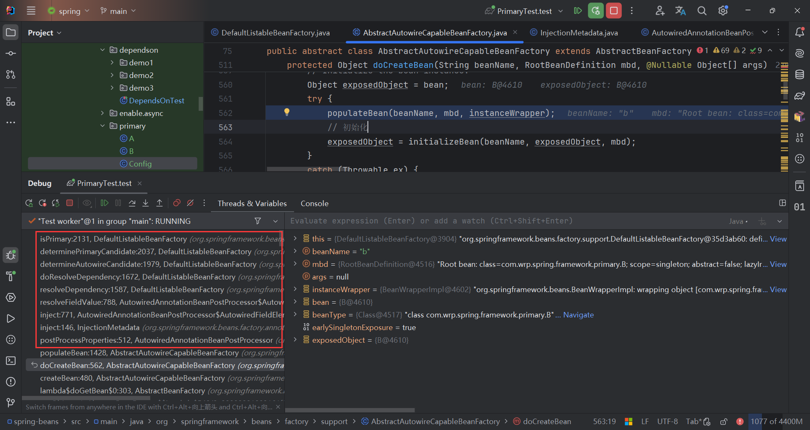

## 测试

```java
public class A {}

@Component
public class B {

	@Autowired
	A a;
}

@ComponentScan
@Configuration
public class Config {

	@Bean
	public A a1() {
		return new A();
	}
    
	@Bean
	public A a2() {
		return new A();
	}

}
```

测试报错`NoUniqueBeanDefinitionException`

```java
public class PrimaryTest {

    @Test
    public void test() {
       new AnnotationConfigApplicationContext(Config.class);

    }
}
```

```tex
org.springframework.beans.factory.NoUniqueBeanDefinitionException: No qualifying bean of type 'com.wrp.spring.framework.primary.A' available: expected single matching bean but found 2: a1,a2
```

调整，a1()上增加`@Primary`，报错消失。

```java
@ComponentScan
@Configuration
public class Config {

	@Primary
	@Bean
	public A a1() {
		return new A();
	}

	@Bean
	public A a2() {
		return new A();
	}
}
```

## 原理

BeanDefinition中有个primary属性。

在创建B的过程中发现需要注入A ，Spring会先从容器中获取到所有类型为A的Bean，发现此时有多个A，然后判断是否存在primaryBean。



```java
@Nullable
protected String determinePrimaryCandidate(Map<String, Object> candidates, Class<?> requiredType) {
    String primaryBeanName = null;
    // First pass: identify unique primary candidate
    for (Map.Entry<String, Object> entry : candidates.entrySet()) {
       String candidateBeanName = entry.getKey();
       Object beanInstance = entry.getValue();
        // 是否有且仅有一个primaryBean
       if (isPrimary(candidateBeanName, beanInstance)) {
          if (primaryBeanName != null) {
             boolean candidateLocal = containsBeanDefinition(candidateBeanName);
             boolean primaryLocal = containsBeanDefinition(primaryBeanName);
             if (candidateLocal == primaryLocal) {
                throw new NoUniqueBeanDefinitionException(requiredType, candidates.size(),
                      "more than one 'primary' bean found among candidates: " + candidates.keySet());
             }
             else if (candidateLocal) {
                primaryBeanName = candidateBeanName;
             }
          }
          else {
             primaryBeanName = candidateBeanName;
          }
       }
    }
    // Second pass: identify unique non-fallback candidate
    if (primaryBeanName == null) {
       for (String candidateBeanName : candidates.keySet()) {
          if (!isFallback(candidateBeanName)) {
             if (primaryBeanName != null) {
                return null;
             }
             primaryBeanName = candidateBeanName;
          }
       }
    }
    return primaryBeanName;
}

protected boolean isPrimary(String beanName, Object beanInstance) {
    String transformedBeanName = transformedBeanName(beanName);
    if (containsBeanDefinition(transformedBeanName)) {
        return getMergedLocalBeanDefinition(transformedBeanName).isPrimary();
    }
    // 递归查询父类
    return (getParentBeanFactory() instanceof DefaultListableBeanFactory parent &&
            parent.isPrimary(transformedBeanName, beanInstance));
}
```