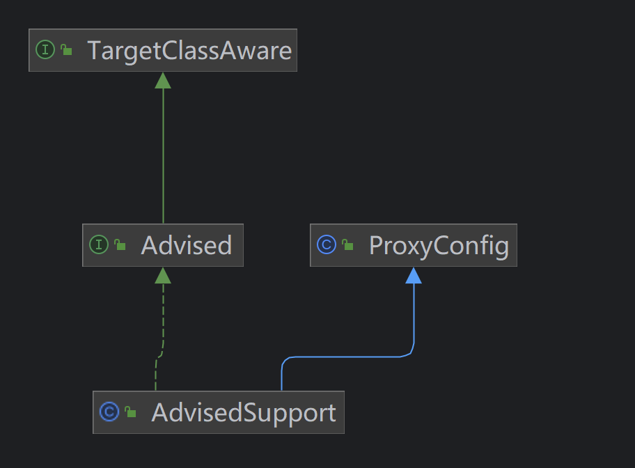
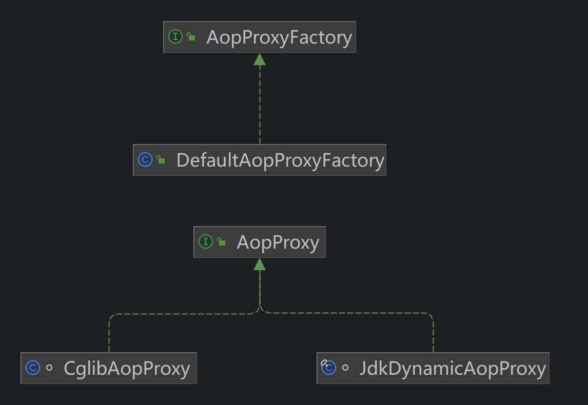

## 1. AOP概念

1. `目标对象` 被增加的对象
2. `连接点（JoinPoint）` 被拦截到的程序执行点，即方法
3. `代理对象` 生成的一个代理对象
4. `通知（Advice）` 增强的功能，以及方法的什么地方
5. `切入点（Pointcut）`指定拦截哪些方法
6. `切面`定义在哪些地方（Pointcut）执行什么操作（Advice）
7. `顾问（Advisor）`是Pointcut与Advice的组合对象

### 1.1 连接点（Joinpoint）


1. Joinpint 连接点，`proceed`可以转发到下一个连接点

```java
public interface Joinpoint {

	// 转到拦截器链中的下一个拦截器
	@Nullable
	Object proceed() throws Throwable;

	// 返回保存当前连接点静态部分【的对象】，这里一般指被代理的目标对象
	@Nullable
	Object getThis();

	//  一般就为当前的Method
	@Nonnull
	AccessibleObject getStaticPart();

}
```

2. Invocation 一次调用

```java
public interface Invocation extends Joinpoint {

    // 获取调用目标方法的参数
	@Nonnull
	Object[] getArguments();

}
```

3. MethodInvocation 方法调用

```java
public interface MethodInvocation extends Invocation {

 	// 被调用的方法
    @Nonnull
    Method getMethod();

}
```

4. ProxyMethodInvocation 代理方法调用

```java
public interface ProxyMethodInvocation extends MethodInvocation {

    /**
     * 获取代理对象
     */
    Object getProxy();

    /**
     * 克隆MethodInvocation
     */
    MethodInvocation invocableClone();

    /**
     * 克隆MethodInvocation
     */
    MethodInvocation invocableClone(Object... arguments);

    /**
     * 设置参数，作用于后续通知
     */
    void setArguments(Object... arguments);

    /**
     * 设置用户属性
     */
    void setUserAttribute(String key, @Nullable Object value);

    /**
     * 获取用户属性
     */
    @Nullable
    Object getUserAttribute(String key);

}
```

5. ReflectiveMethodInvocation jdk动态代理方法调用

```java
public class ReflectiveMethodInvocation implements ProxyMethodInvocation, Cloneable {

	// 代理对象
	protected final Object proxy;

	// 目标对象
	@Nullable
	protected final Object target;

	// 调用的方法
	protected final Method method;

	// 方法参数
	protected Object[] arguments;

	// 目标类的类型
	@Nullable
	private final Class<?> targetClass;

	// 用户类型
	@Nullable
	private Map<String, Object> userAttributes;

	// 拦截器列表
	protected final List<?> interceptorsAndDynamicMethodMatchers;

	// 拦截器索引下标
	private int currentInterceptorIndex = -1;
}
```

### 1.2 通知（Advice）

#### 1.2.1 Advice

> 通知（Advice）用来指定需要增强的逻辑，一个方法可以添加多个Advice，最终被转换为`MethodInterceptor`类型的方法拦截器，组成一个方法调用链


1. Advice 通知

```java
public interface Advice {}
```

2. MethodBeforeAdvice 前置通知

```java
public interface BeforeAdvice extends Advice {

}
```

```java
public interface MethodBeforeAdvice extends BeforeAdvice {

    /**
     * 调用目标方法之前会先调用这个before方法
     * method：需要执行的目标方法
     * args：目标方法的参数
     * target：目标对象
     */
    void before(Method method, Object[] args, @Nullable Object target) throws Throwable;

}
```

3. AfterReturningAdvice 后置通知

```java
public interface AfterAdvice extends Advice {

}
```

```java
public interface AfterReturningAdvice extends AfterAdvice {

    // 目标方法正常执行后，才会回调这个接口，当目标方法有异常，那么这通知会被跳过
    void afterReturning(@Nullable Object returnValue, Method method, Object[] args, @Nullable Object target) throws Throwable;

}
```

4. ThrowsAdvice 异常通知

> 此接口没有方法，因为方法是反射调用了，必须实现如下的`afterThrowing`方法

```java
public interface ThrowsAdvice extends AfterAdvice {
	
	// void afterThrowing([Method, args, target], ThrowableSubclass);
}
```

5. MethodInterceptor 方法拦截器

> 上面的三种通知，通过适配器模式将其转换为MethodInterceptor

```java
public interface Interceptor extends Advice {

}
```

```java
@FunctionalInterface
public interface MethodInterceptor extends Interceptor {

	// 拦截目标方法的执行
	@Nullable
	Object invoke(@Nonnull MethodInvocation invocation) throws Throwable;

}
```

#### 1.2.2 通知包装器

> **将各种非MethodInterceptor类型的通知(Advice)包装为MethodInterceptor类型。**

1. MethodBeforeAdviceInterceptor 前置通知拦截器

```java
public class MethodBeforeAdviceInterceptor implements MethodInterceptor, BeforeAdvice, Serializable {

    private final MethodBeforeAdvice advice;

    public MethodBeforeAdviceInterceptor(MethodBeforeAdvice advice) {
       Assert.notNull(advice, "Advice must not be null");
       this.advice = advice;
    }


    @Override
    @Nullable
    public Object invoke(MethodInvocation mi) throws Throwable {
       this.advice.before(mi.getMethod(), mi.getArguments(), mi.getThis());
       return mi.proceed();
    }

}
```

2. AfterReturningAdviceInterceptor 后置通知拦截器

```java
public class AfterReturningAdviceInterceptor implements MethodInterceptor, AfterAdvice, Serializable {

    private final AfterReturningAdvice advice;

    public AfterReturningAdviceInterceptor(AfterReturningAdvice advice) {
       Assert.notNull(advice, "Advice must not be null");
       this.advice = advice;
    }

    @Override
    @Nullable
    public Object invoke(MethodInvocation mi) throws Throwable {
       Object retVal = mi.proceed();
       this.advice.afterReturning(retVal, mi.getMethod(), mi.getArguments(), mi.getThis());
       return retVal;
    }

}
```

3. ThrowsAdviceInterceptor

> 关键在`invoke`方法中，通过try...catch的方式捕获方法的异常，通过对应的异常处理方法处理了异常后，**继续将异常抛出**

```java
public class ThrowsAdviceInterceptor implements MethodInterceptor, AfterAdvice {

    // 方法名称
    private static final String AFTER_THROWING = "afterThrowing";

    // 异常通知
    private final Object throwsAdvice;

    // 异常对应的处理方法
    private final Map<Class<?>, Method> exceptionHandlerMap = new HashMap<>();

    public ThrowsAdviceInterceptor(Object throwsAdvice) {
       Assert.notNull(throwsAdvice, "Advice must not be null");
       this.throwsAdvice = throwsAdvice;

       Method[] methods = throwsAdvice.getClass().getMethods();
       for (Method method : methods) {
          // 查询指定名称的方法 afterThrowing
          if (method.getName().equals(AFTER_THROWING)) {
             Class<?> throwableParam = null;
             // 校验参数，1个参数时，必须是Throwable类型的
             if (method.getParameterCount() == 1) {
                // just a Throwable parameter
                throwableParam = method.getParameterTypes()[0];
                if (!Throwable.class.isAssignableFrom(throwableParam)) {
                   throw new AopConfigException("Invalid afterThrowing signature: " +
                         "single argument must be a Throwable subclass");
                }
             }
             // 4个参数时，必须是Method, Object[], target, Throwable类型的，第三个参数如果是Throwable就会报错
             else if (method.getParameterCount() == 4) {
                // Method, Object[], target, throwable
                Class<?>[] paramTypes = method.getParameterTypes();
                if (!Method.class.equals(paramTypes[0]) || !Object[].class.equals(paramTypes[1]) ||
                      Throwable.class.equals(paramTypes[2]) || !Throwable.class.isAssignableFrom(paramTypes[3])) {
                   throw new AopConfigException("Invalid afterThrowing signature: " +
                         "four arguments must be Method, Object[], target, throwable: " + method);
                }
                throwableParam = paramTypes[3];
             }
             // 其他情况的参数会导致throwableParam== null， 直接报错
             if (throwableParam == null) {
                throw new AopConfigException("Unsupported afterThrowing signature: single throwable argument " +
                      "or four arguments Method, Object[], target, throwable expected: " + method);
             }
             // 缓存异常：方法。如果多个方法处理同一个异常，就会报错
             Method existingMethod = this.exceptionHandlerMap.put(throwableParam, method);
             if (existingMethod != null) {
                throw new AopConfigException("Only one afterThrowing method per specific Throwable subclass " +
                      "allowed: " + method + " / " + existingMethod);
             }
          }
       }

       // 如果异常通知没有合适的处理异常的方法，也会报错
       if (this.exceptionHandlerMap.isEmpty()) {
          throw new AopConfigException(
                "At least one handler method must be found in class [" + throwsAdvice.getClass() + "]");
       }
    }

    public int getHandlerMethodCount() {
       return this.exceptionHandlerMap.size();
    }


    @Override
    @Nullable
    public Object invoke(MethodInvocation mi) throws Throwable {
       try {
          return mi.proceed();
       }
       catch (Throwable ex) {
          // 方法出现异常时，catch异常，查询异常处理器来处理异常，最后将该异常抛出
          Method handlerMethod = getExceptionHandler(ex);
          // 有对应的异常处理方法才进行处理
          if (handlerMethod != null) {
             invokeHandlerMethod(mi, ex, handlerMethod);
          }
          throw ex;
       }
    }

    @Nullable
    private Method getExceptionHandler(Throwable exception) {
       Class<?> exceptionClass = exception.getClass();
       if (logger.isTraceEnabled()) {
          logger.trace("Trying to find handler for exception of type [" + exceptionClass.getName() + "]");
       }
       Method handler = this.exceptionHandlerMap.get(exceptionClass);
       // 如果handler为空，则遍历父类，查询父类是否有合适的异常处理器
       while (handler == null && exceptionClass != Throwable.class) {
          exceptionClass = exceptionClass.getSuperclass();
          handler = this.exceptionHandlerMap.get(exceptionClass);
       }
       return handler;
    }

    private void invokeHandlerMethod(MethodInvocation mi, Throwable ex, Method method) throws Throwable {
       Object[] handlerArgs;
       // 根据参数个数，决定传递的参数
       if (method.getParameterCount() == 1) {
          // 一个参数时，传递ex异常对象
          handlerArgs = new Object[] {ex};
       }
       else {
          // 四个参数时，传递4个参数 method args target ex
          handlerArgs = new Object[] {mi.getMethod(), mi.getArguments(), mi.getThis(), ex};
       }
       try {
          // 反射调用方法
          method.invoke(this.throwsAdvice, handlerArgs);
       }
       catch (InvocationTargetException targetEx) {
          throw targetEx.getTargetException();
       }
    }

}
```

### 1.3 切入点（Pointcut）

> 切入点（Pointcut）指定了哪些类的哪些方法需要被增强

1. Pointcut 切入点

```java
public interface Pointcut {

    /**
     * 类过滤器, 可以知道哪些类需要拦截
     */
    ClassFilter getClassFilter();

    /**
     * 方法匹配器, 可以知道哪些方法需要拦截
     */
    MethodMatcher getMethodMatcher();


    /**
     * 全匹配的切入点
     */
    Pointcut TRUE = TruePointcut.INSTANCE;

}
```

2. ClassFilter 类过滤器

```java
@FunctionalInterface
public interface ClassFilter {

    /**
     * 指定类型是否匹配
     */
    boolean matches(Class<?> clazz);


    /**
     * 默认匹配的类过滤器
     */
    ClassFilter TRUE = TrueClassFilter.INSTANCE;

}
```

3. MethodMatcher 方法匹配器

> 先调用`matches(Method method, Class<?> targetClass)`，如果`isRuntime=false`，将结果缓存起来提升效率；如果`isRuntime=true`，就会调用`matches(Method method, Class<?> targetClass, Object... args)`进一步判断参数。

```java
public interface MethodMatcher {

    /**
     * 指定类的指定方法是否匹配
     */
    boolean matches(Method method, Class<?> targetClass);

    /**
     * 是否是动态匹配，即是否校验方法及方法参数
     */
    boolean isRuntime();

    /**
     * 动态匹配，每次执行目标方法的时候都去验证一下
     */
    boolean matches(Method method, Class<?> targetClass, Object... args);


    /**
     * 默认匹配的方法匹配器
     */
    MethodMatcher TRUE = TrueMethodMatcher.INSTANCE;

}
```

### 1.4 顾问（Advisor）

> 组合Advice和Pointcut

1. Advisor 顾问

```java
public interface Advisor {

    /**
     * 空的通知
     */
    Advice EMPTY_ADVICE = new Advice() {};


    /**
     * 获取通知
     */
    Advice getAdvice();

    /**
     * 通知是共享的还是特定的
     */
    default boolean isPerInstance() {
       return true;
    }

}
```

2. PointcutAdvisor 切入点顾问

> 大部分都是PointcutAdvisor

```java
public interface PointcutAdvisor extends Advisor {

	Pointcut getPointcut();

}
```

3. IntroductionAdvisor 介绍顾问

```java
// 一个Java类，没有实现A接口，在不修改Java类的情况下，
// 使其具备A接口的功能。
// 可以通过IntroductionAdvisor给目标类引入更多接口的功能
public interface IntroductionAdvisor extends Advisor, IntroductionInfo {

    /**
     * 获取类过滤器
     */
    ClassFilter getClassFilter();

    /**
     * 校验接口是否能通过IntroductionAdvisor实现
     */
    void validateInterfaces() throws IllegalArgumentException;

}
```

```java
public interface IntroductionInfo {

    /**
     * 获取接口信息
     */
    Class<?>[] getInterfaces();

}
```

4. DefaultPointcutAdvisor 默认的切入点顾问

```java
public class DefaultPointcutAdvisor extends AbstractGenericPointcutAdvisor implements Serializable {

    // 默认切入点
    private Pointcut pointcut = Pointcut.TRUE;

    public DefaultPointcutAdvisor() {
    }

    public DefaultPointcutAdvisor(Advice advice) {
       this(Pointcut.TRUE, advice);
    }

    public DefaultPointcutAdvisor(Pointcut pointcut, Advice advice) {
       this.pointcut = pointcut;
       setAdvice(advice);
    }

    public void setPointcut(@Nullable Pointcut pointcut) {
       this.pointcut = (pointcut != null ? pointcut : Pointcut.TRUE);
    }

    @Override
    public Pointcut getPointcut() {
       return this.pointcut;
    }

}
```

```java
public abstract class AbstractGenericPointcutAdvisor extends AbstractPointcutAdvisor {

    // 默认通知
    private Advice advice = EMPTY_ADVICE;

    public void setAdvice(Advice advice) {
       this.advice = advice;
    }

    @Override
    public Advice getAdvice() {
       return this.advice;
    }

}
```

```java
public abstract class AbstractPointcutAdvisor implements PointcutAdvisor, Ordered, Serializable {

    @Nullable
    private Integer order;


    public void setOrder(int order) {
       this.order = order;
    }

    @Override
    public int getOrder() {
       if (this.order != null) {
          return this.order;
       }
       Advice advice = getAdvice();
       if (advice instanceof Ordered ordered) {
          return ordered.getOrder();
       }
       return Ordered.LOWEST_PRECEDENCE;
    }

}
```

## 2. AOP原理

> 使用**jdk动态代理和cglib代理**来创建代理对象，通过代理对象来访问目标对象，而代理对象中融入了增强的代码，最终起到对目标对象增强的效果。

### 2.1 案例

```java
@Test
public void test1() {
    //定义目标对象
    UserService target = new UserService();
    //创建pointcut，用来拦截UserService中的work方法
    Pointcut pointcut = new Pointcut() {
       @Override
       public ClassFilter getClassFilter() {
          //判断是否是UserService类型的
          return clazz -> UserService.class.isAssignableFrom(clazz);
       }

       @Override
       public MethodMatcher getMethodMatcher() {
          return new MethodMatcher() {
             @Override
             public boolean matches(Method method, Class<?> targetClass) {
                //判断方法名称是否是work
                return "work".equals(method.getName());
             }

             @Override
             public boolean isRuntime() {
                return false;
             }

             @Override
             public boolean matches(Method method, Class<?> targetClass, Object... args) {
                return false;
             }
          };
       }
    };
    //创建通知，此处需要在方法之前执行操作，所以需要用到MethodBeforeAdvice类型的通知
    MethodBeforeAdvice advice = (method, args, target1) -> System.out.println("你好:" + args[0]);

    //创建Advisor，将pointcut和advice组装起来
    DefaultPointcutAdvisor advisor = new DefaultPointcutAdvisor(pointcut, advice);

    //通过spring提供的代理创建工厂来创建代理
    ProxyFactory proxyFactory = new ProxyFactory();
    //为工厂指定目标对象
    proxyFactory.setTarget(target);
    //调用addAdvisor方法，为目标添加增强的功能，即添加Advisor，可以为目标添加很多个Advisor
    proxyFactory.addAdvisor(advisor);
    //通过工厂提供的方法来生成代理对象
    UserService userServiceProxy = (UserService) proxyFactory.getProxy();

    //调用代理的work方法
    userServiceProxy.work("wrp");
}
```

分为四步：

1. 创建ProxyFactory代理工厂
2. 设置目标对象
3. 设置顾问
4. 创建代理对象


### 2.2 创建代理的参数配置



1. TargetClassAware 目标对象感知

```java
public interface TargetClassAware {

	/**
	 * 获取被代理对象的Class类型
	 */
	@Nullable
	Class<?> getTargetClass();

}

```

2. ProxyConfig 代理类配置

```java
public class ProxyConfig implements Serializable {

    // 是否使用CGLIB
    private boolean proxyTargetClass = false;

    // 是否增强代理对象
    // true，代理对象被创建后，增强的修改将不会生效
    // 如果exposeProxy设置为true，即使optimize为true也会被忽略，即修改增强后会生效。
    private boolean optimize = false;

    // 是否阻止代理对象转换为Advised类型,默认false，代理对象可以转为Advised
    boolean opaque = false;

    // 代理对象是否可以通过AopContext以ThreadLocal暴露
    boolean exposeProxy = false;

    // 是否冻结配置,true无法修改通知
    private boolean frozen = false;
    
    // get set ...
}
```

3. Advised 

> 代理对象都是实现了Advised接口，可以动态变更代理对象中的通知。
>
> 主要是管理顾问、通知。

```java
public interface Advised extends TargetClassAware {

	/**
	 * 配置是否被冻结，被冻结后无法修改代理配置
	 */
	boolean isFrozen();

	/**
	 * 是否cglib代理对象
	 */
	boolean isProxyTargetClass();

	/**
	 * 获取配置中需要代理的接口列表
	 */
	Class<?>[] getProxiedInterfaces();

	/**
	 * 判断指定接口是否被代理
	 */
	boolean isInterfaceProxied(Class<?> ifc);

	/**
	 * 设置目标源，目标对象被包装为TargetSource
	 */
	void setTargetSource(TargetSource targetSource);

	/**
	 * 获取目标源
	 */
	TargetSource getTargetSource();

	/**
	 * 设置是否暴露代理对象
	 */
	void setExposeProxy(boolean exposeProxy);

	/**
	 * 是否暴露代理对象
	 */
	boolean isExposeProxy();

	/**
	 * true，做了预处理，为代理调用构建实际的advisor链时可以跳过ClassFilter检查。
	 */
	void setPreFiltered(boolean preFiltered);

	/**
	 * 是否做了预处理过滤
	 */
	boolean isPreFiltered();

	/**
	 * 获取所有的顾问数组
	 */
	Advisor[] getAdvisors();

	/**
	 * 获取顾问的数量
	 */
	default int getAdvisorCount() {
		return getAdvisors().length;
	}

	/**
	 * 添加顾问
	 */
	void addAdvisor(Advisor advisor) throws AopConfigException;

	/**
	 * 添加顾问到指定位置
	 */
	void addAdvisor(int pos, Advisor advisor) throws AopConfigException;

	/**
	 * 移除顾问
	 */
	boolean removeAdvisor(Advisor advisor);

	/**
	 * 移除指定位置的顾问
	 */
	void removeAdvisor(int index) throws AopConfigException;

	/**
	 * 查询顾问的位置
	 */
	int indexOf(Advisor advisor);

	/**
	 * 替换指定的顾问为新顾问
	 */
	boolean replaceAdvisor(Advisor a, Advisor b) throws AopConfigException;

	/**
	 * 添加通知
	 */
	void addAdvice(Advice advice) throws AopConfigException;

	/**
	 * 添加通知到指定位置
	 */
	void addAdvice(int pos, Advice advice) throws AopConfigException;

	/**
	 * 移除指定通知
	 */
	boolean removeAdvice(Advice advice);

	/**
	 * 查询指定通知的位置
	 */
	int indexOf(Advice advice);

	/**
	 * 将代理配置转换为字符串，这个方便排错和调试使用的
	 */
	String toProxyConfigString();

}

```

4. AdvisedSupport 

- 配置中添加的Advice对象最终都会被转换为DefaultPointcutAdvisor对象
- 当配置被冻结的时候，即frozen为true的时，此时配置中的Advisor列表是不允许修改的。
- 目标方法和其关联的方法拦截器列表会被缓存在`methodCache`中，当顾问列表有变化的时候，`methodCache`缓存会被清除。

```java
public class AdvisedSupport extends ProxyConfig implements Advised {

    public static final TargetSource EMPTY_TARGET_SOURCE = EmptyTargetSource.INSTANCE;

    // 目标源，默认是EMPTY_TARGET_SOURCE
    TargetSource targetSource = EMPTY_TARGET_SOURCE;

    // 是否做过预处理
    private boolean preFiltered = false;

    // 调用链工厂，获取目标方法的调用链
    private AdvisorChainFactory advisorChainFactory = DefaultAdvisorChainFactory.INSTANCE;

    // 代理对象需要实现的接口列表
    private List<Class<?>> interfaces = new ArrayList<>();

    // 存储顾问，添加的Advice会被包装成Advisor对象， DefaultPointcutAdvisor
    private List<Advisor> advisors = new ArrayList<>();

    private List<Advisor> advisorKey = this.advisors;

    // 以方法为键，以顾问链表为值的缓存
    @Nullable
    private transient Map<MethodCacheKey, List<Object>> methodCache;

    // 缓存的顾问
    @Nullable
    private transient volatile List<Object> cachedInterceptors;

    @Nullable
    transient volatile Object proxyMetadataCache;
    
    // 调用代理的方法时会执行
    // 基于当前配置，获取给定方法的方法调用链列表
	public List<Object> getInterceptorsAndDynamicInterceptionAdvice(Method method, @Nullable Class<?> targetClass) {
		List<Object> cachedInterceptors;
		if (this.methodCache != null) {
			// Method-specific cache for method-specific pointcuts
			MethodCacheKey cacheKey = new MethodCacheKey(method);
			// 从缓存中获取
			cachedInterceptors = this.methodCache.get(cacheKey);
			if (cachedInterceptors == null) {
				// 通过工厂获取
				cachedInterceptors = this.advisorChainFactory.getInterceptorsAndDynamicInterceptionAdvice(
						this, method, targetClass);
				// 放入缓存中
				this.methodCache.put(cacheKey, cachedInterceptors);
			}
		}
		else {
			// Shared cache since there are no method-specific advisors (see below).
			// 获取缓存的顾问
			cachedInterceptors = this.cachedInterceptors;
			if (cachedInterceptors == null) {
				// 通过工厂获取
				cachedInterceptors = this.advisorChainFactory.getInterceptorsAndDynamicInterceptionAdvice(
						this, method, targetClass);
				// 放入缓存的顾问列表
				this.cachedInterceptors = cachedInterceptors;
			}
		}
		return cachedInterceptors;
	}
}
```


### 2.3 根据代理参数获取AopProxy



1. AopProxyFactory aopProxy工厂

> 根据代理配置创建aop代理

```java
//使用的是简单工厂模式
public interface AopProxyFactory {

    AopProxy createAopProxy(AdvisedSupport config) throws AopConfigException;

}
```

2. DefaultAopProxyFactory 默认工厂

> 指定proxyTargetClass来强制执行CGLIB代理，
>
> 指定一个或多个接口来使用JDK动态代理。

```java
public class DefaultAopProxyFactory implements AopProxyFactory, Serializable {

    public static final DefaultAopProxyFactory INSTANCE = new DefaultAopProxyFactory();

    @Override
    public AopProxy createAopProxy(AdvisedSupport config) throws AopConfigException {
       // optimize = true || proxyTargetClass = true || 未指定代理接口
       if (config.isOptimize() || config.isProxyTargetClass() || !config.hasUserSuppliedInterfaces()) {
          Class<?> targetClass = config.getTargetClass();
          // 既没有指定代理类，也没有指定代理接口
          if (targetClass == null && config.getProxiedInterfaces().length == 0) {
             throw new AopConfigException("TargetSource cannot determine target class: " +
                   "Either an interface or a target is required for proxy creation.");
          }
          // 没有指定代理类  || 被代理类是接口 || jdk代理类 || lambda类
          if (targetClass == null || targetClass.isInterface() ||
                Proxy.isProxyClass(targetClass) || ClassUtils.isLambdaClass(targetClass)) {
             return new JdkDynamicAopProxy(config);
          }
          return new ObjenesisCglibAopProxy(config);
       }
       else {
          return new JdkDynamicAopProxy(config);
       }
    }

}
```

3. AopProxy aop代理

```java
public interface AopProxy {

    // 创建一个新的代理对象
    Object getProxy();

    // 创建一个新的代理对象
    Object getProxy(@Nullable ClassLoader classLoader);

    // 加载代理对象的Class
    Class<?> getProxyClass(@Nullable ClassLoader classLoader);

}
```

3. JdkDynamicAopProxy


4. CglibAopProxy


### 


### 
