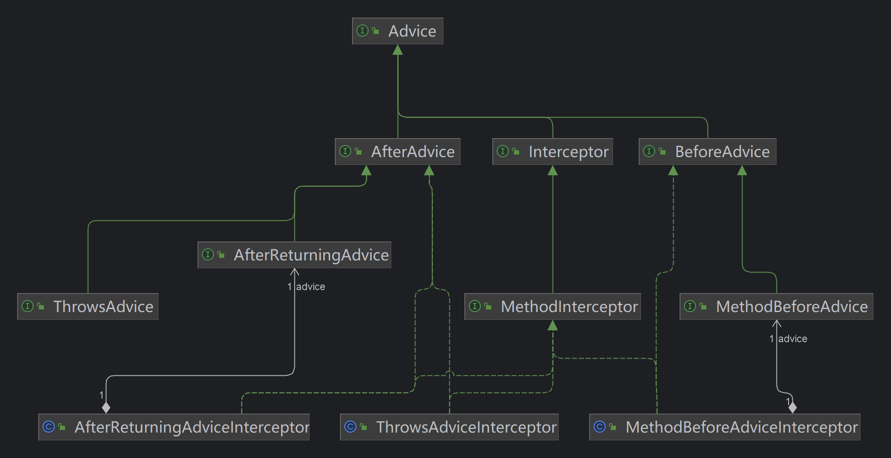

## 1. 概念

1. `目标对象` 被增加的对象
2. `连接点（JoinPoint）` 被拦截到的程序执行点，即方法
3. `代理对象` 生成的一个代理对象
4. `通知（Advice）` 增强的功能，以及方法的什么地方
5. `切入点（Pointcut）`指定拦截哪些方法
6. `切面`定义在哪些地方（Pointcut）执行什么操作（Advice）
7. `顾问（Advisor）`是Pointcut与Advice的组合对象

### 1.1 连接点（Joinpoint）


1. Joinpint 连接点，`proceed`可以转发到下一个连接点

```java
public interface Joinpoint {

	// 转到拦截器链中的下一个拦截器
	@Nullable
	Object proceed() throws Throwable;

	// 返回保存当前连接点静态部分【的对象】，这里一般指被代理的目标对象
	@Nullable
	Object getThis();

	//  一般就为当前的Method
	@Nonnull
	AccessibleObject getStaticPart();

}
```

2. Invocation 一次调用

```java
public interface Invocation extends Joinpoint {

    // 获取调用目标方法的参数
	@Nonnull
	Object[] getArguments();

}
```

3. MethodInvocation 方法调用

```java
public interface MethodInvocation extends Invocation {

 	// 被调用的方法
    @Nonnull
    Method getMethod();

}
```

### 1.2 通知（Advice）

> 通知（Advice）用来指定需要增强的逻辑，一个方法可以添加多个Advice，最终被转换为`MethodInterceptor`类型的方法拦截器，组成一个方法调用链



1. Advice 通知

```java
public interface Advice {}
```

2. MethodBeforeAdvice 前置通知

```java
public interface MethodBeforeAdvice extends BeforeAdvice {

    /**
     * 调用目标方法之前会先调用这个before方法
     * method：需要执行的目标方法
     * args：目标方法的参数
     * target：目标对象
     */
    void before(Method method, Object[] args, @Nullable Object target) throws Throwable;

}
```

3. AfterReturningAdvice 后置通知

```java
public interface AfterReturningAdvice extends AfterAdvice {

    // 目标方法正常执行后，才会回调这个接口，当目标方法有异常，那么这通知会被跳过
    void afterReturning(@Nullable Object returnValue, Method method, Object[] args, @Nullable Object target) throws Throwable;

}
```

4. ThrowsAdvice 异常通知

> 此接口没有方法，因为方法是反射调用了，必须实现如下的`afterThrowing`方法

```java
public interface ThrowsAdvice extends AfterAdvice {
	
	// void afterThrowing([Method, args, target], ThrowableSubclass);
}
```

5. MethodInterceptor 方法拦截器

> 上面的三种通知，通过适配器模式将其转换为MethodInterceptor

```java
@FunctionalInterface
public interface MethodInterceptor extends Interceptor {

	// 拦截目标方法的执行
	@Nullable
	Object invoke(@Nonnull MethodInvocation invocation) throws Throwable;

}
```

### 1.3 切入点（Pointcut）

> 切入点（Pointcut）指定了哪些类的哪些方法需要被增强

1. Pointcut 切入点

```java
public interface Pointcut {

    /**
     * 类过滤器, 可以知道哪些类需要拦截
     */
    ClassFilter getClassFilter();

    /**
     * 方法匹配器, 可以知道哪些方法需要拦截
     */
    MethodMatcher getMethodMatcher();


    /**
     * 全匹配的切入点
     */
    Pointcut TRUE = TruePointcut.INSTANCE;

}
```

2. ClassFilter 类过滤器

```java
@FunctionalInterface
public interface ClassFilter {

    /**
     * 指定类型是否匹配
     */
    boolean matches(Class<?> clazz);


    /**
     * 默认匹配的类过滤器
     */
    ClassFilter TRUE = TrueClassFilter.INSTANCE;

}
```

3. MethodMatcher 方法匹配器

> 先调用

```java
public interface MethodMatcher {

    /**
     * 指定类的指定方法是否匹配
     */
    boolean matches(Method method, Class<?> targetClass);

    /**
     * 是否是动态匹配，即是否校验方法及方法参数
     */
    boolean isRuntime();

    /**
     * 动态匹配，每次执行目标方法的时候都去验证一下
     */
    boolean matches(Method method, Class<?> targetClass, Object... args);


    /**
     * 默认匹配的方法匹配器
     */
    MethodMatcher TRUE = TrueMethodMatcher.INSTANCE;

}
```

### 1.4 顾问（Advisor）

1. Advisor 顾问

```java
public interface Advisor {

    /**
     * 空的通知
     */
    Advice EMPTY_ADVICE = new Advice() {};


    /**
     * 获取通知
     */
    Advice getAdvice();

    /**
     * 通知是共享的还是特定的
     */
    default boolean isPerInstance() {
       return true;
    }

}
```

2. PointcutAdvisor 切入点顾问

> 大部分都是PointcutAdvisor

```java
public interface PointcutAdvisor extends Advisor {

	Pointcut getPointcut();

}
```

3. IntroductionAdvisor 介绍顾问

```java
// 一个Java类，没有实现A接口，在不修改Java类的情况下，
// 使其具备A接口的功能。
// 可以通过IntroductionAdvisor给目标类引入更多接口的功能
public interface IntroductionAdvisor extends Advisor, IntroductionInfo {

    /**
     * 获取类过滤器
     */
    ClassFilter getClassFilter();

    /**
     * 校验接口是否能通过IntroductionAdvisor实现
     */
    void validateInterfaces() throws IllegalArgumentException;

}
```

```java
public interface IntroductionInfo {

    /**
     * 获取接口信息
     */
    Class<?>[] getInterfaces();

}
```


