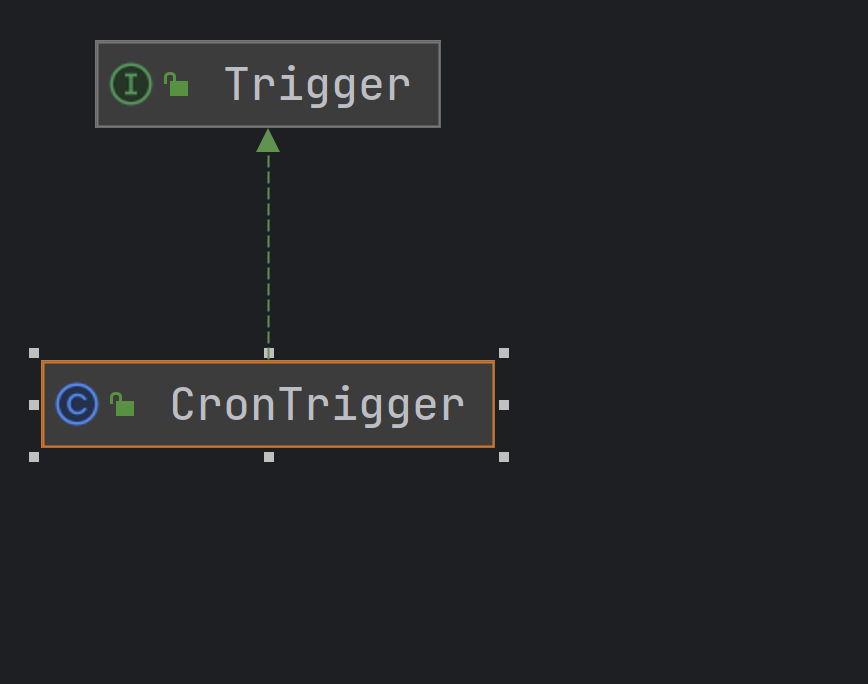

## 1. 使用方法

### 1.1 开启定时任务

`@EnableScheduling`可以开启定时任务功能。

```java
@Configuration
@EnableScheduling
public class Config {
}
```

### 1.1 方法1 cron表达式

> cron表达式：用于指定定时任务执行时间的字符串表达式。
>
> [在线表达式生成器](!https://cron.ciding.cc/)

------

```tex
            ┌──────────── [可选] 秒 (0 - 59)
            | ┌────────── 分钟 (0 - 59)
            | | ┌──────── 小时 (0 - 23)
            | | | ┌────── 天数 (1 - 31)
            | | | | ┌──── 月份 (1 - 12) OR jan,feb,mar,apr ...
            | | | | | ┌── 星期几 (0 - 6, 星期天 = 0) OR sun,mon ...
            | | | | | |
            * * * * * * 命令
```

```java
// 每秒执行一次任务
@Scheduled(cron = "0/1 * * * * ?") 
public void task0() throws InterruptedException {
    System.out.println("config: " + Thread.currentThread().getName());
}
```

### 1.2 方法2 fixedRate

> 按照指定速率执行，从方法执行的开始时间算

```java
// 默认单位是毫秒，3000毫秒执行一次任务
@Scheduled(fixedRate = 3000)
public void task1() throws InterruptedException {
    System.out.println("fixedRate = 3000, " + System.currentTimeMillis());
}

// 指定单位，3s执行一次任务
@Scheduled(fixedRate = 3, timeUnit = TimeUnit.SECONDS)
public void task2() {
    System.out.println("fixedRate = 3, " + System.currentTimeMillis());
}
```

### 1.3 方法3 fixedDelay

> 按照指定延迟执行，从方法执行完成时间算

```java
// 5000毫秒执行一次任务
@Scheduled(fixedDelay = 5000)
public void task3() {
    System.out.println("fixedDelay = 5000, "+ System.currentTimeMillis());
}
```

### 1.4 方法4 initialDelay

> 初始延迟时间，当不指定cron、fixedRate、fixedDelay时，此任务为单次任务

```java
// 系统启动2000毫秒后执行一次任务
@Scheduled(initialDelay = 2000)
public void task4() {
    System.out.println("@Scheduled");
}
```

当不指定任务参数时，报错：Encountered invalid @Scheduled method 'task4': One-time task only supported with specified initial delay。

```java
@Scheduled
public void task4() {
    System.out.println("@Scheduled");
}
```

## 2. 核心原理

1. `EnableScheduling`注解通过`@Import`注解导入`SchedulingConfiguration`配置类

```java
@Target(ElementType.TYPE)
@Retention(RetentionPolicy.RUNTIME)
@Import(SchedulingConfiguration.class)
@Documented
public @interface EnableScheduling {
}
```

2. `SchedulingConfiguration`配置类导入`ScheduledAnnotationBeanPostProcessor`类，`ScheduledAnnotationBeanPostProcessor`是一个`BeanPostProcessor`，会参与到Bean的生命周期中

```java
@Configuration(proxyBeanMethods = false)
@Role(BeanDefinition.ROLE_INFRASTRUCTURE)
public class SchedulingConfiguration {

	@Bean(name = TaskManagementConfigUtils.SCHEDULED_ANNOTATION_PROCESSOR_BEAN_NAME)
	@Role(BeanDefinition.ROLE_INFRASTRUCTURE)
	public ScheduledAnnotationBeanPostProcessor scheduledAnnotationProcessor() {
		return new ScheduledAnnotationBeanPostProcessor();
	}
}
```

3. `ScheduledAnnotationBeanPostProcessor#postProcessAfterInitialization`解析配置类，将带`@Scheduled`注解的方法缓存起来，详情见源码分析3.1

4. `ScheduledAnnotationBeanPostProcessor`类监听了`ApplicationContextEvent`事件，会根据`ApplicationContext`的生命周期进行定时任务的启动和取消

```java
@Override
public void onApplicationEvent(ApplicationContextEvent event) {
    if (event.getApplicationContext() == this.applicationContext) {
        // ApplicationContext完成后会发布ContextRefreshedEvent，进行定时任务解析
        if (event instanceof ContextRefreshedEvent) {
            finishRegistration();
        }
        // ApplicationContext关闭时发布ContextClosedEvent，进行定时任务取消
        else if (event instanceof ContextClosedEvent) {
            for (Object bean : this.manualCancellationOnContextClose) {
                cancelScheduledTasks(bean);
            }
            this.manualCancellationOnContextClose.clear();
        }
    }
}
```

5. `ScheduledAnnotationBeanPostProcessor`类继承了`SmartInitializingSingleton`，会参与`ApplicationContext`的生命周期中，实例化所有单例Bean后会调用`SmartInitializingSingleton#afterSingletonsInstantiated`方法

```java
@Override
public void afterSingletonsInstantiated() {
    // Remove resolved singleton classes from cache
    this.nonAnnotatedClasses.clear();

    if (this.applicationContext == null) {
        // 在非ApplicationContext环境下生效
        finishRegistration();
    }
}
```

6. 关键在`finishRegistration`方法中，底层使用`ScheduledTaskRegistrar`存储了所有的定时任务

```java
private void finishRegistration() {
    if (this.scheduler != null) {
       this.registrar.setScheduler(this.scheduler);
    }
    else {
       this.localScheduler = new TaskSchedulerRouter();
       this.localScheduler.setBeanName(this.beanName);
       this.localScheduler.setBeanFactory(this.beanFactory);
       this.registrar.setTaskScheduler(this.localScheduler);
    }

    if (this.beanFactory instanceof ListableBeanFactory lbf) {
       // 定时任务ScheduledTaskRegistrar的定制化
       Map<String, SchedulingConfigurer> beans = lbf.getBeansOfType(SchedulingConfigurer.class);
       List<SchedulingConfigurer> configurers = new ArrayList<>(beans.values());
       AnnotationAwareOrderComparator.sort(configurers);
       for (SchedulingConfigurer configurer : configurers) {
          configurer.configureTasks(this.registrar);
       }
    }

    this.registrar.afterPropertiesSet();
}
```

7. `ScheduledTaskRegistrar#afterPropertiesSet`底层调用了`scheduleTasks`方法，启动不同类型的定时任务

```java
protected void scheduleTasks() {
    if (this.taskScheduler == null) {
        this.localExecutor = Executors.newSingleThreadScheduledExecutor();
        this.taskScheduler = new ConcurrentTaskScheduler(this.localExecutor);
    }
    if (this.triggerTasks != null) {
        for (TriggerTask task : this.triggerTasks) {
            addScheduledTask(scheduleTriggerTask(task));
        }
    }
    if (this.cronTasks != null) {
        for (CronTask task : this.cronTasks) {
            addScheduledTask(scheduleCronTask(task));
        }
    }
    if (this.fixedRateTasks != null) {
        for (IntervalTask task : this.fixedRateTasks) {
            if (task instanceof FixedRateTask fixedRateTask) {
                addScheduledTask(scheduleFixedRateTask(fixedRateTask));
            }
            else {
                addScheduledTask(scheduleFixedRateTask(new FixedRateTask(task)));
            }
        }
    }
    if (this.fixedDelayTasks != null) {
        for (IntervalTask task : this.fixedDelayTasks) {
            if (task instanceof FixedDelayTask fixedDelayTask) {
                addScheduledTask(scheduleFixedDelayTask(fixedDelayTask));
            }
            else {
                addScheduledTask(scheduleFixedDelayTask(new FixedDelayTask(task)));
            }
        }
    }
    if (this.oneTimeTasks != null) {
        for (DelayedTask task : this.oneTimeTasks) {
            if (task instanceof OneTimeTask oneTimeTask) {
                addScheduledTask(scheduleOneTimeTask(oneTimeTask));
            }
            else {
                addScheduledTask(scheduleOneTimeTask(new OneTimeTask(task)));
            }
        }
    }
}
```

8. 在`scheduleXXXTask`方法中调用定时任务，如`scheduleCronTask`，核心是调用`this.taskScheduler.schedule(task.getRunnable(), task.getTrigger());`，默认的taskScheduler是`TaskSchedulerRouter`类。

```java
public ScheduledTask scheduleCronTask(CronTask task) {
    ScheduledTask scheduledTask = this.unresolvedTasks.remove(task);
    boolean newTask = false;
    if (scheduledTask == null) {
       scheduledTask = new ScheduledTask(task);
       newTask = true;
    }
    if (this.taskScheduler != null) {
       scheduledTask.future = this.taskScheduler.schedule(task.getRunnable(), task.getTrigger());
    }
    else {
       addCronTask(task);
       this.unresolvedTasks.put(task, scheduledTask);
    }
    return (newTask ? scheduledTask : null);
}
```

9. `TaskSchedulerRouter`类分析，可见底层默认使用的`JUC`中的`ScheduledExecutorService`，并包装成`ConcurrentTaskScheduler`

```java
public class TaskSchedulerRouter implements TaskScheduler, BeanNameAware, BeanFactoryAware, DisposableBean {
	private final Supplier<TaskScheduler> defaultScheduler = SingletonSupplier.of(this::determineDefaultScheduler);
    
    @Override
	@Nullable
	public ScheduledFuture<?> schedule(Runnable task, Trigger trigger) {
		return determineTargetScheduler(task).schedule(task, trigger);
	}
    
    protected TaskScheduler determineTargetScheduler(Runnable task) {
		String qualifier = determineQualifier(task);
		if (this.embeddedValueResolver != null && StringUtils.hasLength(qualifier)) {
			qualifier = this.embeddedValueResolver.resolveStringValue(qualifier);
		}
		if (StringUtils.hasLength(qualifier)) {
			return determineQualifiedScheduler(qualifier);
		}
		else {
			return this.defaultScheduler.get();
		}
	}
    
    protected TaskScheduler determineDefaultScheduler() {
		try {
			// Search for TaskScheduler bean...
			return resolveSchedulerBean(this.beanFactory, TaskScheduler.class, false);
		}
		// 默认生成ScheduledExecutor
		ScheduledExecutorService localExecutor = Executors.newSingleThreadScheduledExecutor();
		this.localExecutor = localExecutor;
		return new ConcurrentTaskScheduler(localExecutor);
	}
}
```

10. `ConcurrentTaskScheduler`类的`schedule`方法直接委派`ScheduledExecutorService`的`schedule`方法进行调用，最终启动完成定时任务。

```java
@Override
public ScheduledFuture<?> schedule(Runnable task, Instant startTime) {
    ScheduledExecutorService scheduleExecutorToUse = getScheduledExecutor();
    Duration delay = Duration.between(this.clock.instant(), startTime);
    try {
       return scheduleExecutorToUse.schedule(decorateTask(task, false), NANO.convert(delay), NANO);
    }
    catch (RejectedExecutionException ex) {
       throw new TaskRejectedException(scheduleExecutorToUse, task, ex);
    }
}
```

## 3. 源码分析

### 3.1 ScheduledAnnotationBeanPostProcessor结构

```java
public class ScheduledAnnotationBeanPostProcessor
    // ScheduledTaskHolder 缓存了任务和任务的执行结果
    // MergedBeanDefinitionPostProcessor 实际上是一个BeanPostProcessor
    // DestructionAwareBeanPostProcessor 销毁前取消任务
    // Aware 导入EmbeddedValueResolver、BeanName、BeanFactory、ApplicationContext
    // SmartInitializingSingleton 
    // DisposableBean 销毁Bean时，取消定时任务
    // ApplicationListener 根据ApplicationContext的生命周期进行定时任务的注册与取消
       implements ScheduledTaskHolder, MergedBeanDefinitionPostProcessor, DestructionAwareBeanPostProcessor,
       Ordered, EmbeddedValueResolverAware, BeanNameAware, BeanFactoryAware, ApplicationContextAware,
       SmartInitializingSingleton, DisposableBean, ApplicationListener<ApplicationContextEvent> {
}
```

### 3.2 解析@Schedule

1. `ScheduledAnnotationBeanPostProcessor`实现了`MergedBeanDefinitionPostProcessor`

```java
@Override
public Object postProcessAfterInitialization(Object bean, String beanName) {
    if (bean instanceof AopInfrastructureBean || bean instanceof TaskScheduler ||
            bean instanceof ScheduledExecutorService) {
        // Ignore AOP infrastructure such as scoped proxies.
        return bean;
    }

    Class<?> targetClass = AopProxyUtils.ultimateTargetClass(bean);
    if (!this.nonAnnotatedClasses.contains(targetClass) &&
            AnnotationUtils.isCandidateClass(targetClass, List.of(Scheduled.class, Schedules.class))) {
        // 收集方法上的Scheduled
        Map<Method, Set<Scheduled>> annotatedMethods = MethodIntrospector.selectMethods(targetClass,
                (MethodIntrospector.MetadataLookup<Set<Scheduled>>) method -> {
                    Set<Scheduled> scheduledAnnotations = AnnotatedElementUtils.getMergedRepeatableAnnotations(
                            method, Scheduled.class, Schedules.class);
                    return (!scheduledAnnotations.isEmpty() ? scheduledAnnotations : null);
                });
        if (annotatedMethods.isEmpty()) {
            this.nonAnnotatedClasses.add(targetClass);
            if (logger.isTraceEnabled()) {
                logger.trace("No @Scheduled annotations found on bean class: " + targetClass);
            }
        }
        else {
            // 遍历集合，解析定时任务
            annotatedMethods.forEach((method, scheduledAnnotations) ->
                    scheduledAnnotations.forEach(scheduled -> processScheduled(scheduled, method, bean)));
            if (logger.isTraceEnabled()) {
                logger.trace(annotatedMethods.size() + " @Scheduled methods processed on bean '" + beanName +
                        "': " + annotatedMethods);
            }
            if ((this.beanFactory != null &&
                    (!this.beanFactory.containsBean(beanName) || !this.beanFactory.isSingleton(beanName)) ||
                    (this.beanFactory instanceof SingletonBeanRegistry sbr && sbr.containsSingleton(beanName)))) {
                // Either a prototype/scoped bean or a FactoryBean with a pre-existing managed singleton
                // -> trigger manual cancellation when ContextClosedEvent comes in
                this.manualCancellationOnContextClose.add(bean);
            }
        }
    }
    return bean;
}
```

2. 解析定时任务，分同步和异步两种方式，本次主要分析同步方式

```java
protected void processScheduled(Scheduled scheduled, Method method, Object bean) {
    
    if (reactiveStreamsPresent && ScheduledAnnotationReactiveSupport.isReactive(method)) {
       processScheduledAsync(scheduled, method, bean);
       return;
    }
    processScheduledSync(scheduled, method, bean);
}

private void processScheduledSync(Scheduled scheduled, Method method, Object bean) {
    Runnable task;
    try {
        task = createRunnable(bean, method, scheduled.scheduler());
    }
    catch (IllegalArgumentException ex) {
        throw new IllegalStateException("Could not create recurring task for @Scheduled method '" +
                method.getName() + "': " + ex.getMessage());
    }
    processScheduledTask(scheduled, task, method, bean);
}
```

3. 创建任务，将任务封装成`ScheduledMethodRunnable`

```java
protected Runnable createRunnable(Object target, Method method, @Nullable String qualifier) {
    Method invocableMethod = AopUtils.selectInvocableMethod(method, target.getClass());
    // 封装了Bean + 定时任务方法
    return new ScheduledMethodRunnable(target, invocableMethod, qualifier, this.registrar::getObservationRegistry);
}
```

5. 解析定时任务注解`@Scheduled`，将根据不同的属性创建不同的定时任务，最终存储在`ScheduledAnnotationBeanPostProcessor`的`scheduledTasks`集合中。

- `cron`任务 创建 `CronTask`，带`CronTrigger`触发器

- `fixedRate`任务 创建`FixedRateTask`

- `fixedDelay`任务 创建`FixedDelayTask`

- 单次任务 创建`OneTimeTask`

```java
private final Map<Object, Set<ScheduledTask>> scheduledTasks = new IdentityHashMap<>(16);

private void processScheduledTask(Scheduled scheduled, Runnable runnable, Method method, Object bean) {
    try {
       boolean processedSchedule = false;
       String errorMessage = "Exactly one of the 'cron', 'fixedDelay' or 'fixedRate' attributes is required";

       Set<ScheduledTask> tasks = new LinkedHashSet<>(4);

       // Determine initial delay
       // 初始化延迟
       Duration initialDelay = toDuration(scheduled.initialDelay(), scheduled.timeUnit());
       String initialDelayString = scheduled.initialDelayString();
       if (StringUtils.hasText(initialDelayString)) {
          Assert.isTrue(initialDelay.isNegative(), "Specify 'initialDelay' or 'initialDelayString', not both");
          if (this.embeddedValueResolver != null) {
             initialDelayString = this.embeddedValueResolver.resolveStringValue(initialDelayString);
          }
          if (StringUtils.hasLength(initialDelayString)) {
             try {
                initialDelay = toDuration(initialDelayString, scheduled.timeUnit());
             }
             catch (RuntimeException ex) {
                throw new IllegalArgumentException(
                      "Invalid initialDelayString value \"" + initialDelayString + "\"; " + ex);
             }
          }
       }

       // Check cron expression
       String cron = scheduled.cron();
       if (StringUtils.hasText(cron)) {
          String zone = scheduled.zone();
          if (this.embeddedValueResolver != null) {
             cron = this.embeddedValueResolver.resolveStringValue(cron);
             zone = this.embeddedValueResolver.resolveStringValue(zone);
          }
          if (StringUtils.hasLength(cron)) {
             Assert.isTrue(initialDelay.isNegative(), "'initialDelay' not supported for cron triggers");
             processedSchedule = true;
             if (!Scheduled.CRON_DISABLED.equals(cron)) {
                CronTrigger trigger;
                if (StringUtils.hasText(zone)) {
                   trigger = new CronTrigger(cron, StringUtils.parseTimeZoneString(zone));
                }
                else {
                   trigger = new CronTrigger(cron);
                }
                tasks.add(this.registrar.scheduleCronTask(new CronTask(runnable, trigger)));
             }
          }
       }

       // At this point we don't need to differentiate between initial delay set or not anymore
       Duration delayToUse = (initialDelay.isNegative() ? Duration.ZERO : initialDelay);

       // Check fixed delay
       Duration fixedDelay = toDuration(scheduled.fixedDelay(), scheduled.timeUnit());
       if (!fixedDelay.isNegative()) {
          Assert.isTrue(!processedSchedule, errorMessage);
          processedSchedule = true;
          tasks.add(this.registrar.scheduleFixedDelayTask(new FixedDelayTask(runnable, fixedDelay, delayToUse)));
       }
       String fixedDelayString = scheduled.fixedDelayString();
       if (StringUtils.hasText(fixedDelayString)) {
          if (this.embeddedValueResolver != null) {
             fixedDelayString = this.embeddedValueResolver.resolveStringValue(fixedDelayString);
          }
          if (StringUtils.hasLength(fixedDelayString)) {
             Assert.isTrue(!processedSchedule, errorMessage);
             processedSchedule = true;
             try {
                fixedDelay = toDuration(fixedDelayString, scheduled.timeUnit());
             }
             catch (RuntimeException ex) {
                throw new IllegalArgumentException(
                      "Invalid fixedDelayString value \"" + fixedDelayString + "\"; " + ex);
             }
             tasks.add(this.registrar.scheduleFixedDelayTask(new FixedDelayTask(runnable, fixedDelay, delayToUse)));
          }
       }

       // Check fixed rate
       Duration fixedRate = toDuration(scheduled.fixedRate(), scheduled.timeUnit());
       if (!fixedRate.isNegative()) {
          Assert.isTrue(!processedSchedule, errorMessage);
          processedSchedule = true;
          tasks.add(this.registrar.scheduleFixedRateTask(new FixedRateTask(runnable, fixedRate, delayToUse)));
       }
       String fixedRateString = scheduled.fixedRateString();
       if (StringUtils.hasText(fixedRateString)) {
          if (this.embeddedValueResolver != null) {
             fixedRateString = this.embeddedValueResolver.resolveStringValue(fixedRateString);
          }
          if (StringUtils.hasLength(fixedRateString)) {
             Assert.isTrue(!processedSchedule, errorMessage);
             processedSchedule = true;
             try {
                fixedRate = toDuration(fixedRateString, scheduled.timeUnit());
             }
             catch (RuntimeException ex) {
                throw new IllegalArgumentException(
                      "Invalid fixedRateString value \"" + fixedRateString + "\"; " + ex);
             }
             tasks.add(this.registrar.scheduleFixedRateTask(new FixedRateTask(runnable, fixedRate, delayToUse)));
          }
       }

       if (!processedSchedule) {
          if (initialDelay.isNegative()) {
             throw new IllegalArgumentException("One-time task only supported with specified initial delay");
          }
          tasks.add(this.registrar.scheduleOneTimeTask(new OneTimeTask(runnable, delayToUse)));
       }

       // 往scheduledTasks缓存定时任务
       // Finally register the scheduled tasks
       synchronized (this.scheduledTasks) {
          Set<ScheduledTask> regTasks = this.scheduledTasks.computeIfAbsent(bean, key -> new LinkedHashSet<>(4));
          regTasks.addAll(tasks);
       }
    }
    catch (IllegalArgumentException ex) {
       throw new IllegalStateException(
             "Encountered invalid @Scheduled method '" + method.getName() + "': " + ex.getMessage());
    }
}
```

6. 在`ScheduledTaskRegistrar`类中统一封装成`ScheduledTask`，最终添加到`ScheduledTaskRegistrar`不同的定时任务集合中

```java
// 触发任务
@Nullable
private List<TriggerTask> triggerTasks;

// cron任务，类似fixedDelayTasks
@Nullable
private List<CronTask> cronTasks;

// 固定速率任务
@Nullable
private List<IntervalTask> fixedRateTasks;

// 固定完成时间间隔任务
@Nullable
private List<IntervalTask> fixedDelayTasks;

// 单次任务
@Nullable
private List<DelayedTask> oneTimeTasks;

// 未启动的定时任务
private final Map<Task, ScheduledTask> unresolvedTasks = new HashMap<>(16);

// 所有启动了的定时任务
private final Set<ScheduledTask> scheduledTasks = new LinkedHashSet<>(16);

// fixedRate任务，其他类似
@Nullable
public ScheduledTask scheduleFixedRateTask(FixedRateTask task) {
    ScheduledTask scheduledTask = this.unresolvedTasks.remove(task);
    boolean newTask = false;
    if (scheduledTask == null) {
       scheduledTask = new ScheduledTask(task);
       newTask = true;
    }
    if (this.taskScheduler != null) {
       Duration initialDelay = task.getInitialDelayDuration();
       if (initialDelay.toNanos() > 0) {
          Instant startTime = this.taskScheduler.getClock().instant().plus(initialDelay);
          scheduledTask.future =
                this.taskScheduler.scheduleAtFixedRate(task.getRunnable(), startTime, task.getIntervalDuration());
       }
       else {
          scheduledTask.future =
                this.taskScheduler.scheduleAtFixedRate(task.getRunnable(), task.getIntervalDuration());
       }
    }
    else {
       addFixedRateTask(task);
       this.unresolvedTasks.put(task, scheduledTask);
    }
    return (newTask ? scheduledTask : null);
}
```


## 4. 架构

### 4.1 Task 任务

> 任务本质上就是Runnable，内部通过反射调用被@Scheduled标记的方法


### 4.2 Trigger 触发器

> Trigger接口的主要作用是计算任务的下次执行时间，主要实现是`CronTrigger`



### 4.3 TaskScheduler 任务调度器

> 主要作用是根据触发条件执行定时任务，内部委派了`ScheduledExecutorService`进行任务调用


### 4.4 ScheduledTaskRegistrar任务注册器

> 存储了不同类型的定时任务，主要功能是注册任务，以及委派`TaskScheduler`来调度任务。

## 5. 常见问题

### 5.1 三种主要方式的区别

1. `cron` 类似`fixedDelay`，可以写表达式，更灵活
2. `fixedRate` 按照指定时间间隔发布任务，会缓存被耽搁的任务，上一次任务完成后，优先执行被耽搁的任务
3. `fixedDelay` 按照方法上一次执行完成时间开始，指定延迟时间后再次执行。

测试1

```java
int count = 0;

@Scheduled(fixedRate = 3000)
public void task5() throws InterruptedException {
    if(count == 3) {
        TimeUnit.SECONDS.sleep(10);
    }
    System.out.println("fixedRate = 3000, " + System.currentTimeMillis() + " count: " + count++);
}
```

从结果看出：

1. 定时任务按照每三秒的间隔执行一次
2. count:2与count:3的间隔为13秒 （3秒间隔 + 10秒sleep）
3. count3执行后，优先执行因为上一次任务执行时间过长而耽搁的任务count4、count5、count6
4. count7与count6之间的间隔不是3秒，因为count7是按照全局3秒间隔来计算的

```tex
fixedRate = 3000, 1747037688756count: 0
fixedRate = 3000, 1747037691753count: 1
fixedRate = 3000, 1747037694744count: 2
fixedRate = 3000, 1747037707754count: 3
fixedRate = 3000, 1747037707754count: 4
fixedRate = 3000, 1747037707754count: 5
fixedRate = 3000, 1747037707754count: 6
fixedRate = 3000, 1747037709746count: 7
fixedRate = 3000, 1747037712753count: 8
fixedRate = 3000, 1747037715744count: 9
fixedRate = 3000, 1747037718755count: 10
```

测试2

```java
int count = 0;

@Scheduled(fixedDelay = 1000)
public void task6() throws InterruptedException {
    if(count == 3) {
       TimeUnit.SECONDS.sleep(10);
    }
    System.out.println("fixedDelay = 1000, "+ System.currentTimeMillis() + " count: " + count++);
}
```

从结果看出：

1. 定时任务按照每秒的间隔执行一次
2. count2与count3的间隔为11秒（1秒间隔 + 10秒sleep）
3. count3之后的间隔都是1秒

```tex
fixedDelay = 1000, 1747038418194 count: 0
fixedDelay = 1000, 1747038419209 count: 1
fixedDelay = 1000, 1747038420218 count: 2
fixedDelay = 1000, 1747038431230 count: 3
fixedDelay = 1000, 1747038432239 count: 4
fixedDelay = 1000, 1747038433243 count: 5
fixedDelay = 1000, 1747038434247 count: 6
fixedDelay = 1000, 1747038435261 count: 7
fixedDelay = 1000, 1747038436273 count: 8
fixedDelay = 1000, 1747038437274 count: 9
```

### 5.2 定时任务不执行的场景

1. 任务执行时间超过间隔时间
   1. @Scheduled + @Async 异步执行任务；
   2. 自定义任务调度器

2. 异常未被捕获

```java
	@Scheduled(initialDelay = 3000)
	public void task7() {
		int a = 10 /0;
	}

	@Scheduled(fixedRate = 1000)
	public void task8() {
		if(count++ == 5) {
			throw new RuntimeException();
		}
		System.out.println("hello");
	}
```

测试结果：

- 任务出现未捕获的异常，不影响其他任务
- 任务出现未捕获的异常，只会影响本次任务的执行，不影响下次执行

3. 系统时间变更

### 5.3 非public方法也能执行任务

```java
@Scheduled(fixedRate = 1000)
private void task9() {
    System.out.println("hello, private");
}

@Scheduled(fixedRate = 1000)
protected void task10() {
    System.out.println("hello, protected");
}

@Scheduled(fixedRate = 1000)
void task11() {
    System.out.println("hello, default");
}
```

## 6. 扩展知识

在`ScheduledAnnotationBeanPostProcessor#finishRegistration`中，会从Spring容器中查询`SchedulingConfigurer`bean，可以定制化任务注册器`ScheduledTaskRegistrar`

```java
private void finishRegistration() {
    if (this.scheduler != null) {
       this.registrar.setScheduler(this.scheduler);
    }
    else {
       this.localScheduler = new TaskSchedulerRouter();
       this.localScheduler.setBeanName(this.beanName);
       this.localScheduler.setBeanFactory(this.beanFactory);
       this.registrar.setTaskScheduler(this.localScheduler);
    }

    if (this.beanFactory instanceof ListableBeanFactory lbf) {
       // 定时任务ScheduledTaskRegistrar的定制化
       Map<String, SchedulingConfigurer> beans = lbf.getBeansOfType(SchedulingConfigurer.class);
       List<SchedulingConfigurer> configurers = new ArrayList<>(beans.values());
       AnnotationAwareOrderComparator.sort(configurers);
       for (SchedulingConfigurer configurer : configurers) {
          configurer.configureTasks(this.registrar);
       }
    }

    this.registrar.afterPropertiesSet();
}
```

### 6.1 自定义任务调度器

方式1 实现SchedulingConfigurer，setTaskScheduler

```java
@Configuration
public class MySchedulingConfigurer implements SchedulingConfigurer {
	@Override
	public void configureTasks(ScheduledTaskRegistrar taskRegistrar) {
		ThreadPoolTaskScheduler threadPoolTaskScheduler = new ThreadPoolTaskScheduler();
		threadPoolTaskScheduler.setPoolSize(4);
		threadPoolTaskScheduler.setThreadNamePrefix("scheduling-");
		threadPoolTaskScheduler.initialize();
		taskRegistrar.setTaskScheduler(threadPoolTaskScheduler);
	}
}
```

方式2 向Spring容器中注入TaskScheduler

```java
@Bean
public TaskScheduler taskScheduler() {
    ThreadPoolTaskScheduler taskScheduler = new ThreadPoolTaskScheduler();
    // 定时任务执行线程池核心线程数
    taskScheduler.setPoolSize(4);
    taskScheduler.setRemoveOnCancelPolicy(true);
    taskScheduler.setThreadNamePrefix("MySchedulerThreadPool-");
    return taskScheduler;
}
```

**注意:方式1的优先级高于方式2**

方式2的原理：

> 默认使用的任务调度器为`TaskSchedulerRouter`，内部调度任务前会先调用`determineTargetScheduler`方法去探测Spring容器中是否存在`TaskScheduler`或`ScheduledExecutorService`bean。
>
> 先根据类型查询，存在多个时再根据名称查询，其中`TaskScheduler`的优先级高于`ScheduledExecutorService`。
>
> 当都失败时，会创建`ConcurrentTaskScheduler`，包含单线程的执行器`Executors.newSingleThreadScheduledExecutor();`

```java
private final Supplier<TaskScheduler> defaultScheduler = SingletonSupplier.of(this::determineDefaultScheduler);
public static final String DEFAULT_TASK_SCHEDULER_BEAN_NAME = "taskScheduler";

@Override
public ScheduledFuture<?> scheduleAtFixedRate(Runnable task, Duration period) {
    return determineTargetScheduler(task).scheduleAtFixedRate(task, period);
}

protected TaskScheduler determineTargetScheduler(Runnable task) {
    String qualifier = determineQualifier(task);
    if (this.embeddedValueResolver != null && StringUtils.hasLength(qualifier)) {
        qualifier = this.embeddedValueResolver.resolveStringValue(qualifier);
    }
    if (StringUtils.hasLength(qualifier)) {
        return determineQualifiedScheduler(qualifier);
    }
    else {
        return this.defaultScheduler.get();
    }
}

protected TaskScheduler determineQualifiedScheduler(String qualifier) {
    try {
        return BeanFactoryAnnotationUtils.qualifiedBeanOfType(this.beanFactory, TaskScheduler.class, qualifier);
    }
    catch (NoSuchBeanDefinitionException | BeanNotOfRequiredTypeException ex) {
        return new ConcurrentTaskScheduler(BeanFactoryAnnotationUtils.qualifiedBeanOfType(
                this.beanFactory, ScheduledExecutorService.class, qualifier));
    }
}

protected TaskScheduler determineDefaultScheduler() {
    Assert.state(this.beanFactory != null, "BeanFactory must be set to find default scheduler");
    try {
        // Search for TaskScheduler bean...
        return resolveSchedulerBean(this.beanFactory, TaskScheduler.class, false);
    }
    catch (NoUniqueBeanDefinitionException ex) {
        try {
            return resolveSchedulerBean(this.beanFactory, TaskScheduler.class, true);
        }
    }
    catch (NoSuchBeanDefinitionException ex) {
        try {
            return new ConcurrentTaskScheduler(resolveSchedulerBean(this.beanFactory, ScheduledExecutorService.class, false));
        }
        catch (NoUniqueBeanDefinitionException ex2) {
            try {
                return new ConcurrentTaskScheduler(resolveSchedulerBean(this.beanFactory, ScheduledExecutorService.class, true));
            }
        }
    }
    // 默认生成ScheduledExecutorService
    ScheduledExecutorService localExecutor = Executors.newSingleThreadScheduledExecutor();
    this.localExecutor = localExecutor;
    return new ConcurrentTaskScheduler(localExecutor);
}

private <T> T resolveSchedulerBean(BeanFactory beanFactory, Class<T> schedulerType, boolean byName) {
    if (byName) {
        T scheduler = beanFactory.getBean(DEFAULT_TASK_SCHEDULER_BEAN_NAME, schedulerType);
        if (this.beanName != null && this.beanFactory instanceof ConfigurableBeanFactory cbf) {
            cbf.registerDependentBean(DEFAULT_TASK_SCHEDULER_BEAN_NAME, this.beanName);
        }
        return scheduler;
    }
    else if (beanFactory instanceof AutowireCapableBeanFactory acbf) {
        NamedBeanHolder<T> holder = acbf.resolveNamedBean(schedulerType);
        if (this.beanName != null && beanFactory instanceof ConfigurableBeanFactory cbf) {
            cbf.registerDependentBean(holder.getBeanName(), this.beanName);
        }
        return holder.getBeanInstance();
    }
    else {
        return beanFactory.getBean(schedulerType);
    }
}
```

### 6.2 动态添加定时任务

通过`SchedulingConfigurer`接口，可以动态添加定时任务

```java
@Configuration
public class MySchedulingConfigurer implements SchedulingConfigurer {
    @Override
    public void configureTasks(ScheduledTaskRegistrar taskRegistrar) {
       taskRegistrar.addCronTask(()-> System.out.println("hello"),
             "*/1 * * * * ?");
    }
}
```
