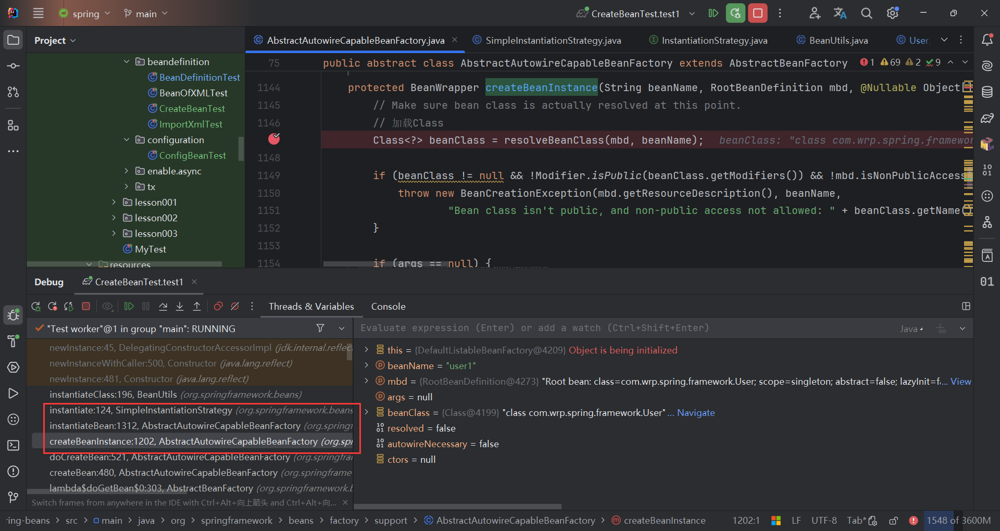
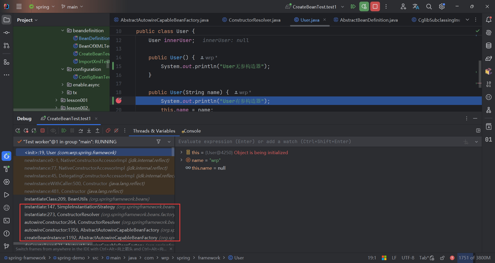

## 单元测试

```java
@Data
public class User {
	String name;
	User innerUser;

	public User() {
		System.out.println("User无参构造器");
	}

	public User(String name) {
		System.out.println("User有参构造器");
		this.name = name;
	}
}

public class StaticFactory {

	public static User createUser() {
		System.out.println("静态工厂方法创建User");
		return new User();
	}
}

public class CreateBeanTest {

	@Test
	public void test1() {
		String xml = "classpath:framework/beandefinition/constructor-createbean.xml";
		DefaultListableBeanFactory beanFactory = new DefaultListableBeanFactory();
		XmlBeanDefinitionReader reader = new XmlBeanDefinitionReader(beanFactory);
		int beanCount = reader.loadBeanDefinitions(xml);
		Assertions.assertEquals(2, beanCount);
		Assertions.assertNull(beanFactory.getBean("user1", User.class).getName());
		Assertions.assertNotNull(beanFactory.getBean("user2", User.class).getName());
	}
}
```

## 源码分析

将断点打在无参构造器和有参构造器中，发现核心代码位于`org.springframework.beans.factory.support.AbstractAutowireCapableBeanFactory#createBeanInstance`方法中。

### 无参构造器方式



走无参分支

```java
protected BeanWrapper createBeanInstance(String beanName, RootBeanDefinition mbd, @Nullable Object[] args) {
    // ignore codes
    // 使用无参构造
    return instantiateBean(beanName, mbd);
}
```

最终进入`instantiateBean`方法中，底层依赖`InstantiationStrategy`接口，在默认实现类`SimpleInstantiationStrategy`中，使用反射创建Bean实例。

### 有参构造器方式



因为配置了构造器参数，使`mbd.hasConstructorArgumentValues()为true`，走`autowireConstructor`分支

```java
protected BeanWrapper createBeanInstance(String beanName, RootBeanDefinition mbd, @Nullable Object[] args) {
    
    // 探测构造器钩子
    Constructor<?>[] ctors;
    if (ctors != null || mbd.getResolvedAutowireMode() == AUTOWIRE_CONSTRUCTOR ||
        mbd.hasConstructorArgumentValues() || !ObjectUtils.isEmpty(args)) {
        // 有候选构造器 || 构造器自动注入模式 || 有构造器参数 || args不为空
        return autowireConstructor(beanName, mbd, ctors, args);
    }

    // 使用无参构造
    return instantiateBean(beanName, mbd);
}
```

底层依赖`ConstructorResolver`类和`InstantiationStrategy`接口;前者获取到相应的构造器及参数，后者使用反射创建bean实例。

## 相关类

1. ConstructorResolver
2. InstantiationStrategy
3. BeanUtils